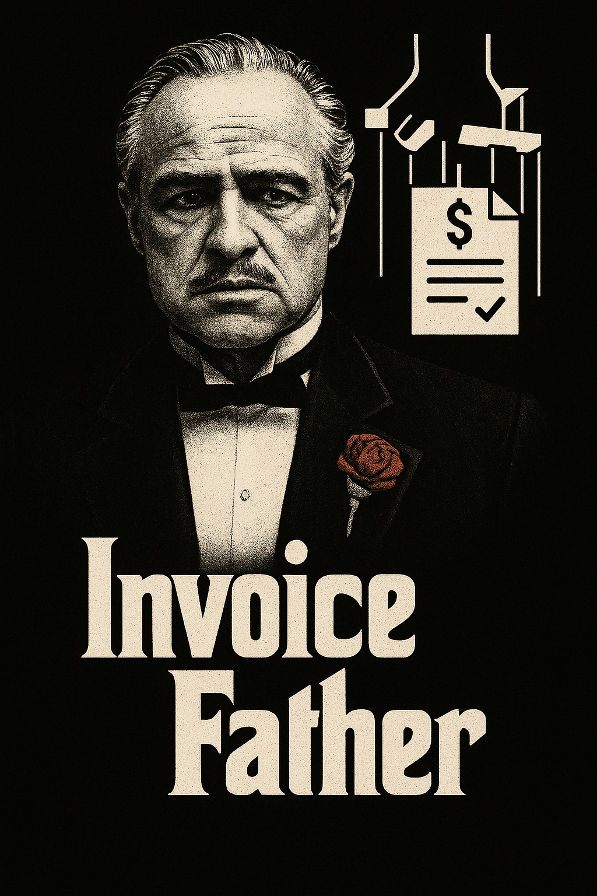

# 🧠 Invoice Father — Extracting Receipt/Invoice Data with OCR + n8n Automation

This project includes an **n8n automation** that uses an OCR (Optical Character Recognition) API to extract text data from receipts or similar documents and automatically transfers the structured data to platforms like Google Sheets.

<div style="text-align: center;">

</div>

---

- 🇹🇷 [Türkçe](./README.tr.md)

## 🔧 Project Components

### 1. OCR API (FastAPI + Tesseract)

This service receives an image in `.jpg` / `.png` format, applies Turkish OCR, and returns the extracted text in JSON format.

#### Features:

- Uses Tesseract OCR (`lang="tur"` for Turkish support).
- Lightweight REST API built with FastAPI.
- Returns only the extracted text (`raw_text`) in the response.

#### Example API Usage:

```http
POST /extract
```

**Request:**

- Form-data: `file` (image file)

**Response:**

```json
{
  "raw_text": "Receipt info dated 27.05.2025..."
}
```

---

### 2. n8n Automation

The automation set up on n8n performs the following steps:

#### 🔄 Workflow:

1. An image file is uploaded via a **Webhook**.
2. The image is sent to the OCR API, and raw text is returned.
3. An AI Agent (Google Gemini / OpenAI) processes the raw text and converts it into a structured JSON format.
4. The resulting JSON is appended as a row in a Google Sheets document.

#### AI Agent Prompt Example:

```text
Extract the company name, address, tax number, date, time, receipt number, product name, product price, and total amount from the receipt text below and return a valid JSON format:

{raw_text}
```

#### Example AI Agent JSON Output:

```json
{
  "company": "101 YENİ MAĞAZACILIK A.Ş",
  "address": "İçerenköy Mh, 2/1 Üsküdar İçerenköy Yolu Caddesi",
  "tax_number": "9480423762",
  "date": "27.05.2025",
  "time": "17:27",
  "receipt_number": "0329",
  "product_name": "Çiğ KOKTEYL 180 6 401",
  "product_price": "89.00",
  "total_amount": "89.00"
}
```

---

### 3. Google Sheets Integration

The structured JSON output is written into a `Google Sheets` document.

#### Required Authorization:

- Create a **Google Service Account**.
- Grant `Edit` access to the target Sheet for the Service Account.
- Upload the `credentials.json` to n8n and configure the Google Sheets node.

---

## 📦 Installation

### For OCR API:

```bash
cd /api
docker build -t ocr-api .
docker run -p 8000:8000 --name ocr-api ocr-api
```

### For n8n:

- Sign up for a cloud account at `n8n.io` or host n8n on your own server.
- Import the workflow from the provided JSON file.
- Configure the AI Agent, OCR API, and Google Sheets nodes.

```bash
cd /n8n
docker compose up -d
```

---

## 📁 File Structure

```plaintext
.
├──api
│  ├── Dockerfile         # Dockerized OCR API
│  ├── main.py            # OCR API source code
│  ├── requirements.txt   # Required Python packages
├──n8n
│  ├── Invoice_Father.json         # n8n workflow template
│  ├── docker-compose.yml          # Local n8n setup
└── README.md
```

---

## 🧐 Use Cases

- Pre-accounting data classification
- OCR-enabled document automation

---

## 📌 Notes

- OCR results may contain errors, so AI prompts should be carefully crafted.
- Receipt formats may vary; prompts should be tested with multiple examples.
- It's recommended to validate JSON before writing to Google Sheets.

---

## 🤝 Contributions & License

Contributions, suggestions, and bug reports are welcome via pull requests.  
This project is distributed under the MIT License.
