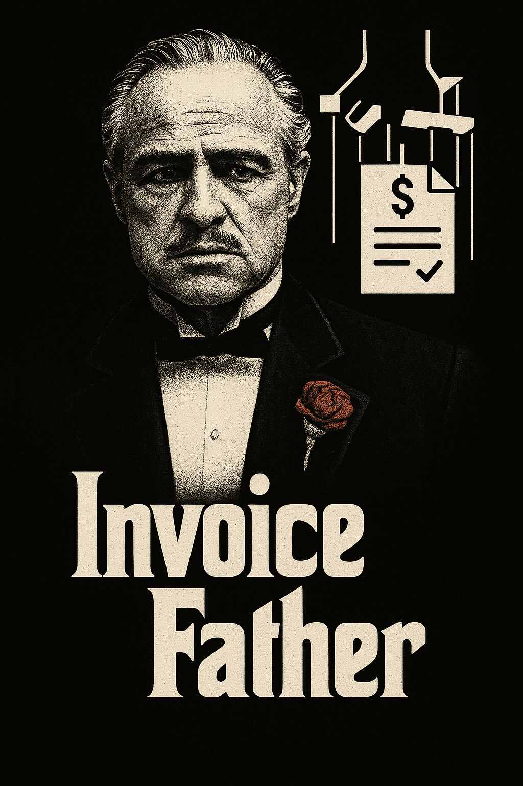

# 🧠Invoice Father OCR + n8n Otomasyonu ile Fiş Verisi Çıkarma

Bu proje, fiş veya makbuz gibi belgelerden metin verisi çıkartmak için bir OCR (Optical Character Recognition) API'si ile bu veriyi otomatik olarak işleyip Google Sheets gibi platformlara aktaran bir **n8n otomasyonu** içerir.

<p align="center">

</p>

## 🔧 Proje Bileşenleri

### 1. OCR API (FastAPI + Tesseract)

Bu servis, `.jpg` / `.png` formatında bir görseli alır, Türkçe OCR işlemi uygular ve metni JSON formatında döndürür.

#### Özellikler:

- Tesseract OCR kullanır (`lang="tur"` Türkçe desteği).
- FastAPI ile geliştirilmiş hafif bir REST servistir.
- Yanıt olarak sadece metni (`raw_text`) döndürür.

#### Örnek API Kullanımı:

```http
POST /extract
```

**Request:**

- Form-data: `file` (görsel dosyası)

**Response:**

```json
{
  "raw_text": "27.05.2025 TARİHİLİ FİŞ BİLGİSİ..."
}
```

### 2. n8n Otomasyonu

n8n üzerinde kurduğumuz bu otomasyon, aşağıdaki adımları izler:

#### 🔄 Akış:

1. **Webhook** üzerinden bir görsel dosya yüklenir.
2. Görsel, OCR API'ye gönderilir ve metin verisi alınır.
3. AI Agent (Google Gemini / OpenAI) kullanılarak metin, yapılandırılmış JSON formatına dönüştürülür.
4. Bu JSON verisi, Google Sheets tablosuna satır olarak eklenir.

#### AI Agent Prompt Örneği:

```text
Aşağıdaki fiş metninden firma adı, adres, vergi numarası, tarih, saat, fiş no, ürün adı, ürün fiyatı ve toplam tutarı çıkart ve geçerli bir JSON formatında döndür:

{raw_text}
```

#### AI Agent JSON Output Örneği:

```json
{
  "firma": "101 YENİ MAĞAZACILIK A.Ş",
  "adres": "İçerenköy Mh, 2/1 Üsküdar İçerenköy Yolu Caddesi",
  "vergi_no": "9480423762",
  "tarih": "27.05.2025",
  "saat": "17:27",
  "fis_no": "0329",
  "urun_adi": "Çiğ KOKTEYL 180 6 401",
  "urun_fiyat": "89,00",
  "toplam_tutar": "89,00"
}
```

### 3. Google Sheets Entegrasyonu

Yapılandırılmış JSON verisi, `Google Sheets`'e eklenir.

#### Gerekli Yetkilendirme:

- Bir **Google Service Account** oluşturulmalı.
- Service Account'a ilgili Sheet için `Edit` izni verilmelidir.
- `credentials.json` n8n’e yüklenerek Google Sheets node'u yapılandırılmalıdır.

---

## 📦 Kurulum

### OCR API için:

```bash
cd /api
docker build -t ocr-api .
docker run -p 8000:8000 --name ocr-api ocr-api
```

### n8n için:

- `n8n.io` üzerinden n8n bulut hesabı açın veya kendi sunucunuza kurun.
- Workflow'u JSON olarak içe aktarın.
- AI Agent, OCR API ve Google Sheets node'larını yapılandırın.

```bash
cd /n8n
docker compose up -d
```

---

## 📁 Dosya Yapısı

```plaintext
.
├──api
  ├── Dockerfile         # Dockerize
  ├── main.py            # OCR API kodları
  ├── requirements.txt   # Gerekli Python paketleri
├──n8n
  ├── Invoice_Father.json         # n8n worflow şablonu
  ├── docker-compose.yml          # n8n local kurulum
└── README.md            #
```

---

## 🧐 Kullanım Senaryoları

- Muhasebe öncesi ön sınıflandırma işlemleri
- OCR destekli belge otomasyonu

---

## 📌 Notlar

- OCR hataları olabileceği için AI Agent prompt'u dikkatle hazırlanmalıdır.
- Fiş formatları değişkenlik gösterebilir. Prompt örneklerle test edilmelidir.
- Google Sheets'e yazmadan önce JSON doğrulaması önerilir.

---

## 🤝 Katkı ve Lisans

Her türlü öneri, katkı ve hata bildirimi için pull request açabilirsiniz. Bu proje MIT lisansı ile dağıtılmaktadır.
